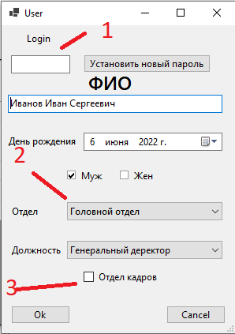

# AppHumanResourcesDepartment
## Требования 
> Наличие [.net 5](https://dotnet.microsoft.com/en-us/download/dotnet/5.0)
> Платформа Windows 10 или выше
> MS sql server

## Настройка appsettings
Прописать в appsettings.json строку подключения БД в HumanResourcesContext

Опционально указать TestingDataBase ("true/false") указывает за генерацию тестовой базы данных.

## Запуск

Вводим логин и пароль 
> Пользователь по умолчанию Admin Admin

> 1 Раздел работы с персоналом. Полный список, редактирование профилей. 
> 2 Раздел работы с данными фирмы, структурыне подразделения, должности. Описание должностей Создать/редактировать.
> 3 Будующий раздел логов учетных данных
> 4 Место для будущего функционала рабочего стола. 

> 1 Общая таблица сотрудников. Показывает всех работающих людей в зависимости от параметров фильтра.
> 2 Фильтр общей таблицы. Ищет по полям таблицы в режиме частичного совпадения по нескольким параметрам. 
> 3 Управление таблицей, работает на выделенного сотрудника. Выделяем сотрудника, Повышаем его в должности. Или редактируем данные.

> 1 Логин пользователя. Может отсутствовать. Задается только тем, кто будет работать с учетными данными. Задается сразу с паролем. 
> 2 Выпадающие списки департаментов и работы. И другие поля. 
> 3 Флаг отдела кадров. Допуск в программу возможен только отделу кадров. По логину и паролу который указывается в карточке. 

> 1 Структура отделов. Отделы не зависят от иерархии. 
> 2 Структура должностей. Деревовидная. От высшей должности, к нисшей. 
> 3 Элементы управления иерархией Должности. 
> 4 Элементы управления структурами. Открыть/Создать/Удалить.

> 1 Название должности
> 2 Элементы управления (Ок/отмена)
> 3 Добавить произвольные поля характеристики должности. 
> 4 Добавленная характеристика должности. 